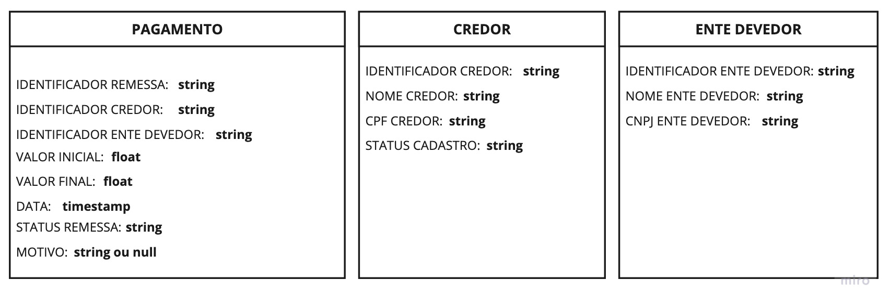

<h3 align="center">
  Desafio: Desenvolvedor back-end.
</h3>

  <a href="#rocket-sobre-o-desafio">Sobre o desafio</a>&nbsp;&nbsp;&nbsp;|&nbsp;&nbsp;&nbsp;
  <a href="#calendar-entrega">Entrega</a>&nbsp;&nbsp;&nbsp;

## :rocket: Sobre o desafio

Agora que você já conheceu um pouco sobre a Precato, queremos propor um desafio para você ja ir se aquecendo para o que está por vir.

Você deve realizar a implementação de um servidor que receberá solicitações de pagamentos e, a partir das regras de negócio definidas, identificar se a solicitação é inválida ou não. Você deve desenvolver uma API REST que valida essas solicitações e armazena seus dados em um banco de dados relacional.

**Sistema de pagamentos:** Na antecipação de precatórios, mais especificamente no pagamento aos credores, é necessário um processo para receber solicitações de pagamentos que devem passar por verificações para determinar se devem prosseguir adiante ou não. As solicitações inválidas devem ser recusadas e vão para um local de consulta, em que um usuário autenticado pode visualizar por qual motivo a solicitação foi recusada.

**Observação:** Sobre qual linguagem de programação e o banco de dados a utilizar, fica a seu critério desde que faça sentido ao desafio proposto.

### Regras de negócio

**1 -** Uma solicitação só pode ser feita se o cadastro do credor a receber o pagamento estiver aprovado.

**2 -** Uma solicitação de pagamento deve sempre haver um ente devedor.

**3 -** Em uma solicitação de pagamento, o valor inicial e final devem ser sempre maiores do que 0.

**4 -** Em uma solicitação de pagamento, o valor final deve ser sempre menor que o valor inicial.

**5 -** Solicitações de pagamentos para um mesmo credor deve ocorrer apenas se o identificador de remessa for diferente das solicitações já existentes.

**6 -** Se uma solicitação for identificada como inválida, o motivo que a definiu como inválida deve ser armazenado.

**Importante: qualquer solicitação de pagamento que exceder as regras de negócio deve ser identificada como inválida.**

### Dados

Para te ajudar a entender um pouco melhor, essas são as três entidades necessárias para você resolver o seu desafio.

  

## :calendar: Entrega

Para entregar esse desafio você deve criar um repositório do Github contendo a sua implementação e enviar o link do mesmo para o email **dev.gi@precato.com.br** até o dia **25/08/2021/**.
